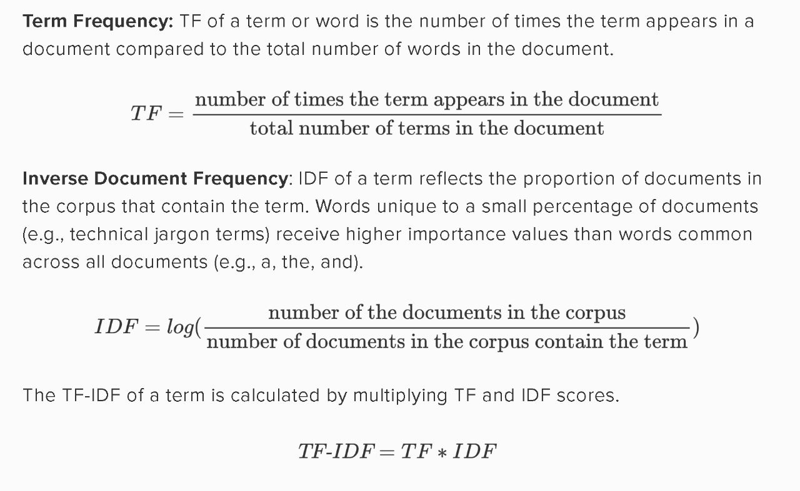

# ❓About the Project

This project has been made as part of the coursework required for CS 250 Data Structures and Alogrithms. The group members include: 

* Taha Mukhtar
* Shalina Riaz
* Muhammad Hassan Bin Adeel

## Project Goals 🥅

The main goal of this project is to develop a scalable and good performance search engine. The main challenges are algorithmic; in compactly representing a large data-set while supporting fast searches on it. 

The Project has been extended over various parts as below:
*  **Task 1**
    
    To summarize the paper "*The Anatomy of a Large-Scale Hypertextual Web Search Engine.* "
*  **Task 2**

    To submit a project proposal concerning the group members, dataset, languages and frameworks to be used.
*  **Task 3**

    To submit the code for generation of *Forward and Inverted Index* on a part of dataset.
*  **Complete Submission**

    To submit the complete code of project along with the documentation.

* **Presentation**

    To present the project in class for explanation and feedback from Instructor and students.

## Table of Contents 📃
* [DataSet](#Dataset)
* [Libraries and Frameworks](#Libraries-and-Frameworks)
* [Set Me Up](#Set-Me-Up)
* [Implementation](#Implementation)
* [Authors](#Authors)
* [FeedBack](#FeedBack)
## Dataset
As described in our project proposal we are using around 150,000 articles from the dataset in HAVARD DATAVERSE named "NELA-GT-2021". It is a Large Multi-Labelled News Dataset for the Study of Misinformation in News Articles".
## Libraries and Frameworks
The following Libraries have been used in the development of this project:

* json
* nltk
* pandas
* numba
* re
* os
* datetime
* HTML,CSS
* JS
* FLask Server

Frameworks used are:

* Flask Python

## Set Me Up
To run the project clone the repository and install the libraries. For installing open VS code or any code editor you use and write the following commands in terminal one by one.

* pip install nltk
* pip install pandas
* pip install numba

The json, re, os, datetime and collections are built-in libraries and modules in python so you don't need to install them.

## Implementation
* **TF-IDF Algorithm**
    TF short for Term Frequency and IDF short for Inverted Document Frequency algorithm is used to rank/sort the page and calculate the score based on number of occurances of word in every document and number of documents which contain the word. The algorithm efficiently sorts the pages and only show relevant pages. The mathematical formula used is below:-

    
* **Parsing And Forward Indexing**

    The json files in dataset are read and tokenized. And then stopwords (i.e, words like 'a','and','the','but' etc) are removed using following libraries.
    * json
    * nltk.tokenize
    * nltk.corpus
    
    Now, we have a list of words from the documents. But for efficient search stemming is applied. As recognizing, searching and retrieving more forms of words for  more results. When a form of a word is recognized, it's possible to return search results that otherwise might have been missed. That additional information retrieved so stemming is integral to search queries and information retrieval. 

    Finally, the function *json_parser* returns document dictionary having forward Indexing for searching the articles.
    The format for forward index is: 
    
    **{Doc_id : {word : TF}}**
    
    *Time Complexity* for json parser is **nln(n)**.
* **Merged Inverted Indexing**

    In inverted index we have unique words from all the documents mapped to document id which is mapped to TF-IDF which helps in page ranking algorithm. So the overall *time complexity* for inverted index is **(ln(n))^2**.
    The format for inverted index is:
    **{word : {docID : TF-IDF}}**

    **Note:** If better methods are found during the advancement of project the code may be changed to perform more efiiciently. 
* **One Word Search**

    Our one word search simply O(1) as it checks in hash table (dictionary) whose search time if key is given is O(1). All relevant one word search docs that appear are made relevant by using TF-IDF rank algorithm

* **Multi Word Search**    

    Multiword search is O(n) as there is comparison of docIDs for calculation of score due to multiple words. HIghest priority page is the one containing all of words in search query and then further TF-IDF algorithm is also applied to make the search more relevant and sorted.
## Authors

- [Shalina Riaz](https://github.com/shalinaariaaz)
- [Taha Mukhtar](https://github.com/tahamukhtar20)
- [Muhammad Hassan Bin Adeel](https://github.com/mhba18094)

## FeedBack
In case of any queries or feedback, please reach out to us at: sriaz.bscs21seecs@seecs.edu.pk
